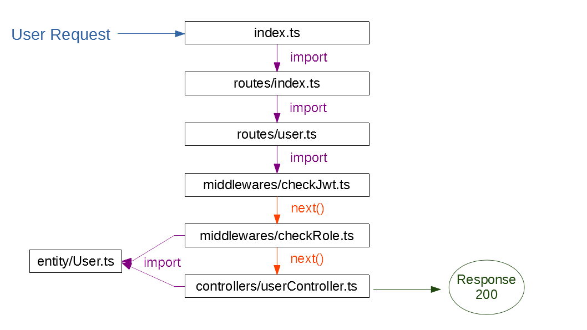

# typeorm-project
Projeto criado com TypeORM, usando o PostgreSQL e o Express

# The Goal:
Uma API de authenticação e relacionamento de usuários e projetos

# Libraries
<h3>Express</h3>
Framework based API development

<h3>typeorm</h3>
The ORM we are going to use to manipulate database

<h3>PostgreSQL</h3>
Opensource SQL database

<h3>sqlite3</h3>
We are going to use sqlite as dev database

<h3>Eslint</h3>
Ainda não implementado

<h3>Prettier</h3>
Ainda não implementado

<h3>helmet</h3>
Help us to secure our application by setting various HTTP headers

<h3>cors</h3>
Enable cross-origin Requests

<h3>body-parser</h3>
Parses the client’s request from json into javascript objects

<h3>jsonwebtoken</h3>
Will handle the jwt operations for us

<h3>bcryptjs</h3>
Help us to hash user passwords

<h3>reflect-metadata</h3>
allow some annotations features used with TypeORM

<h3>class-validator</h3>
A validation package that works really well with TypeORM

<h3>nodemon</h3>
Automatically restarts the server when we change any file

# Operation of user requests

# Project TypeORM & Express => Steps to run this project on your machine:

1. Run `npm i` command
2. Setup database settings inside `ormconfig.json` file
3. Run `npm start` command
